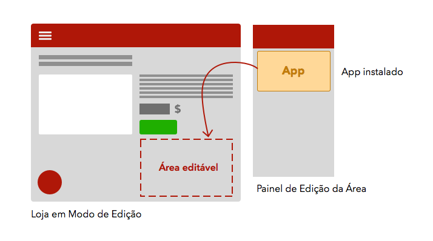

# Ambiente de Desenvolvimento

  O ambiente de desenvolvimento do Storefront foi pensado para garantir mais velocidade e praticidade para desenvolvedores, garantindo que seus apps possam ser facilmente validadas antes de ir para produção.

Depois de rodar o [setup inicial](1-setup-inicial.md) em seu projeto, você irá usar o Toolbelt para visualizar seu App rodando sobre um ambiente de testes durante o desenvolvimento.

Criamos o cenário abaixo apenas para ilustrar o fluxo de desenvolvimento -- você pode vê-lo na prática em nosso tutorial, [Criando seu Primeiro App](3-criando-seu-primeiro-app.md).

---

Digamos que você queira desenvolver um App para que usuários deixem Reviews em cada produto da loja -- para tal, este App deve aparecer em todas as suas páginas de produto.

Para visualizar o App em sua loja durante o desenvolvimento, você irá subi-la em uma **sandbox**, que permite que apenas seu usuário visualizar as alterações em desenvolvimento.

Para isso, é preciso fazer login com suas credenciais no Toolbelt e rodá-lo com o comando `watch`. seu App já estará instalada na sua loja, exclusivamente em sua Sandbox. Saiba mais sobre o Toolbelt em sua [documentação oficial](https://www.npmjs.com/package/vtex).

> OK, agora o App está instalada em minha loja (na Sandbox)... mas como faço para que apareça de fato em minha página de produto?

Isto depende de como o Tema da sua loja (que também é um App!) foi desenvolvido:

 - Caso sua loja use um **[Tema Flexível](../2_conceitos/tema-flexivel.md)** e possua um componente **Área** na página de produto, basta entrar no **Modo de Edição** e configurar sua Área para exibir o App desejada dentro dela.

 Lembre-se que o App só está instalada na Sandbox, então outros usuários não poderão vê-la.

 - Caso seu tema não seja `Flexível`, você precisará do seu código-fonte para editá-lo localmente. Neste caso, você deverá importar o App dentro de seu Tema e rodar o Tema em uma segunda instância do Toolbelt, como exemplificado no esquema abaixo.

 Veja nosso guia para aprender a [importar um App como dependência em seu Tema](4-importar-um-app-como-dependencia.md).

---

Ao terminar o desenvolvimento de seu App, você pode usar o comando `vtex publish` para deixá-lo disponível a lojas pela Gallery. Saiba mais sobre este processo em [Finalizando e Publicando seu App](5-finalizando-e-publicando-seu-app.md).
