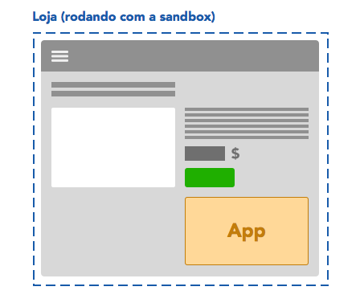
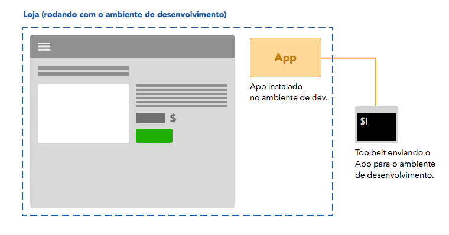
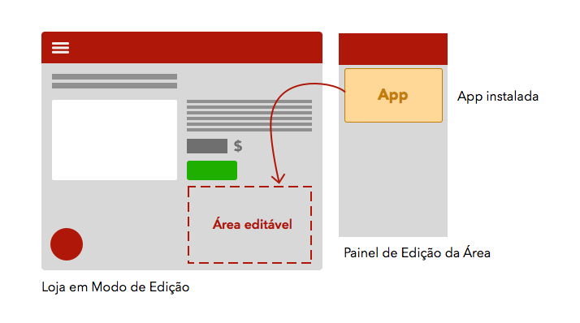
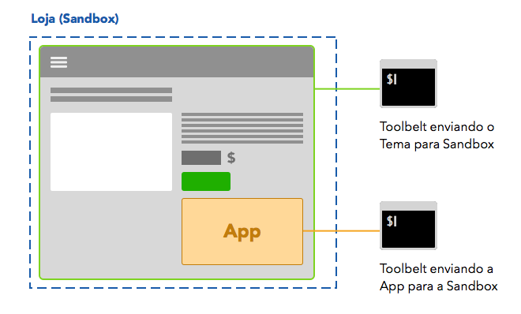

# Ambiente de Desenvolvimento

O ambiente de desenvolvimento do Storefront foi pensado para garantir mais velocidade e praticidade para desenvolvedores, garantindo que suas apps possam ser facilmente validadas antes de ir para produção.

Depois de rodar o [setup inicial](1-setup-inicial.md) em seu projeto, você irá usar o Toolbelt para visualizar sua app rodando sobre um ambiente de testes durante o desenvolvimento.

Criamos o cenário abaixo apenas para ilustrar o fluxo de desenvolvimento -- você pode vê-lo com mais detalhes em nosso tutorial, [Criando sua Primeira App](3-criando-sua-primeira-app.md).

---

Digamos que você queira desenvolver uma app para que usuários deixem Reviews em cada produto da loja -- para tal, esta App deve aparecer em todas as suas páginas de produto.

Para visualizar a App em sua loja durante o desenvolvimento, você irá subi-la em uma **Sandbox**, que permite que apenas seu usuário visualizar as alterações em desenvolvimento.

Para isso, é preciso fazer login com suas credenciais no Toolbelt e rodá-lo com o comando `vtex watch`. Sua App já estará instalada na sua loja, exclusivamente em sua Sandbox. Saiba mais sobre o Toolbelt em sua [documentação oficial](https://www.npmjs.com/package/vtex).

> OK, agora a App está instalada em minha loja (na Sandbox)... mas como faço para que apareça de fato em minha página de produto?

Isto depende de como o Tema da sua loja (que também é uma App!) foi desenvolvido:

 - Caso sua loja use um **[Tema Flexível](#)** (CONCEITO PENDENTE) e possua um componente `Área` na página de produto, basta entrar no `Modo de Edição` e configurar sua `Área` para exibir a App desejada dentro dela.

 Lembre-se que a App só está instalada na Sandbox, então outros usuários não poderão vê-la.

 - Caso seu tema não seja `Flexível`, você precisará do seu código-fonte para editá-lo localmente. Neste caso, você deverá importar a App dentro de seu Tema e rodar o Tema em uma segunda instância do Toolbelt, como exemplificado no esquema abaixo.

 Veja nosso guia para aprender a [importar uma App como dependência em seu Tema](#) **(GUIA PENDENTE)**.

---

Ao terminar o desenvolvimento de sua App, você pode usar o comando `vtex publish` para deixá-la disponível a lojas na Gallery. Saiba mais sobre este processo em [Finalizando e Publicando sua App](#) (**GUIA PENDENTE**).
