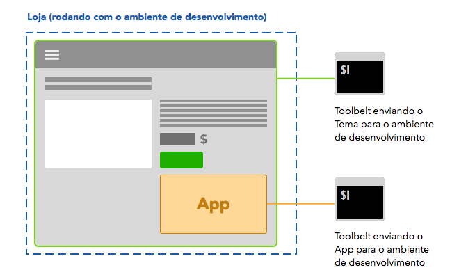

# Development Environment

Storefront's structure was modelled in a way to bring as much speed and ease of use as possible to developers, making sure they could test and validate their Apps before publishing them into production.

In order to achieve this, every App developed with the Toolbelt goes into a _Development Environment_ where only the developer can see it active on the store. Apps added or changed in the _Development Environment_ **will never appear in production** — only when they're published on the Gallery.

After going through the [initial setup](initial-setup.md) in your project, you will use the Toolbelt to see your App running on top of your Dev Environment.

We created the scenario below to illustrate the development process — you can do it in practice with our guides, starting with [creating your first app](creating-your-first-app.md).

---

Let's say you want to develop an App so users are able leave Reviews in every product of your store — an App like this would need to appear in every product page.

To see this App in your store during development, you will push it into your **development environment**, that allows only you (the developer) sees the changes.

To do this, you will have to login with your credentials on Toolbelt and run the `watch` command (see the [official docs](https://github.com/vtex/toolbelt) for more details on this). When you do so, your App will be installed on your store, but only in the development environment.

> OK, now the App is on my store's development environment... but how do I make it appear in my product page?

This depends on how your store's theme (also an App!) was developed:

 - If your store uses a **[Flexible Theme](../glossary/flexible-theme.md)** and has an **Area** component in the product page, you only have to access **Edit Mode** and configure your Area to display the desired App inside it.

 Remember the App will be configured only in your dev environment, so other users won't be able to see it.

 - If your theme is not **Flexible**, you will need its source code to edit it locally. In this case, you should include the App inside your Theme App as a dependency and `watch` both in two instances of the Toolbelt, as shown below.

 Check out our guide on [how to import an App as a dependency](../1_guias/4-importar-um-app-como-dependencia.md).

---

When you finish developing your App you can use the command `vtex publish` to make it available to customers through the Gallery. More details in [Finishing and Publishing your App](../1_guias/5-finalizando-e-publicando-seu-app.md).
