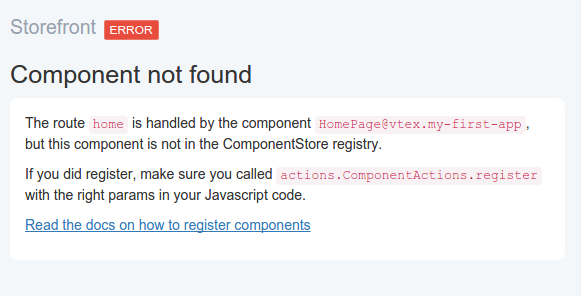

# Registro de Componente

Você deve estar vendo o seguinte erro na tela:



Isso significa que o componente React que responde pela rota "home" não está registrado.

## Registro

Uma das tarefas do Storefront é carregar os arquivos necessários para renderizar a página.

Definimos no arquivo `storefront/settings/routes/home/Root@vtex.storefront-sdk/content.json`, o componente `HomePage@mycompany.my-first-app`.
Por conta disso, os arquivos desse componente foram inseridos na página. Você pode ver no código fonte do browser que o arquivo `HomePage.js` de fato está lá.

Para o React realizar a renderização precisamos fornecer as referências dos componentes React. Para isso, existe a ComponentStore. Ela é uma *store* da arquitetura de dados  [*Flux*](https://facebook.github.io/flux/docs/overview.html) e é usada como registro de todas as referências dos componentes da loja.

Para mudar o dado de uma *store* na arquitetura Flux devemos chamar uma *action*.

Abra o arquivo `storefront/assets/HomePage.jsx` e vamos inserir a *action* que registra componentes.

### `HomePage.jsx`

```js
class HomePage extends React.Component {
  render() {
    return (
      <div><h1>Hello world!</h1></div>
    );
  }
}

const components = [
  {
    name: 'HomePage@mycompany.my-first-app',
    constructor: HomePage
  }
];

// Chama action que registra componentes
storefront.sdk.actions.ComponentActions.register(components);
```

## Hello World!

Rode novamente o Babel para transpilar o arquivo:

```sh
node_modules/.bin/babel ./storefront/assets/**.jsx --out-dir .
```

Por fim, rode o Toolbelt para enviar o novo código:

```sh
vtex watch
```

Você deve ver na tela o famigerado:


---

### Próximos Passos

Leia o [código fonte completo](exemplo-homepage.md) deste guia para internalizar o conhecimento que adquiriu. Em seguida, vá direto para o [guia avançado](../avancado/README.md) para aprender como melhorar o ambiente de desenvolvimento, pegar dados do servidor e outras coisas legais!
